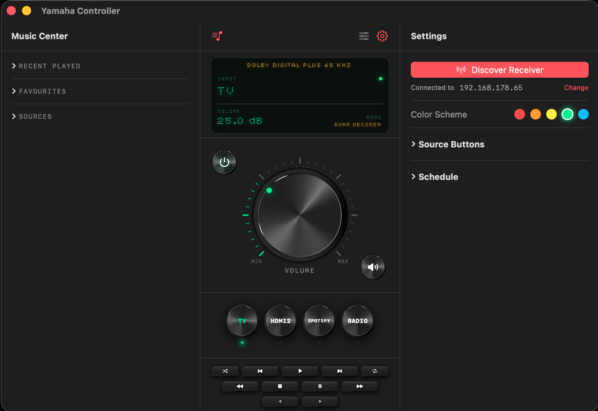

# Yamaha Controller

<p align="center">
  
</p>

A native macOS application for controlling **Yamaha AV receivers** over your local network — no third-party apps, no subscriptions, no cloud.

<p align="center">
  
</p>

<p align="center">
  
  &nbsp;&nbsp;
  
</p>

---

## Features

### Receiver Display
A retro LCD-style panel shows real-time receiver state, rendered in **Bitcount Prop Single ExtraLight** — a bitmap display font that matches the aesthetic of real audio equipment:
- **Signal format** — audio format and sample rate (e.g. `DOLBY DIGITAL PLUS · 48 KHZ`) shown at the top when available
- **Current input source** — large phosphor-style display
- **Volume** — in dB when available, raw value as fallback
- **Sound mode** — DSP/surround program (Straight, Stereo, Surround Decoder, etc.)
- **Shuffle / Repeat indicators** — appear between the volume and mode readouts when active; `⇄` for shuffle, `↻` for repeat all, `↻1` for repeat one
- **Now Playing** — for Spotify and Net Radio inputs, shows the current track title and artist/station name, refreshed every 8 seconds; long names scroll continuously in a right-to-left marquee loop
- **Album art** — thumbnail with accent-colored border displayed for Spotify (always) and Net Radio (when the station provides it); gracefully falls back to text-only layout when unavailable
- **Mute indicator** — highlighted in red when active
- **Power dot** — accent-colored when on, dim when in standby

### Power Control
A compact metallic circular button controls the receiver power state:
- Tap to toggle between **On** and **Standby**
- White power icon; glows with the accent color when the receiver is on
- Animated press feedback
- **Last-source restore**: powers back on to whichever input was active before standby

### Volume Control
A rotating metallic knob controls the receiver volume:
- **Graduation ring** — 31 tick marks around the knob, lit with the accent color up to the current level; MIN / MAX labels at the endpoints
- **Drag** to set volume — circular arc gesture; the knob rotates to follow in real time
- **Scroll wheel** — mouse wheel and trackpad both work
- **Keyboard shortcuts** — `Cmd ↑` / `Cmd ↓` volume up/down, `M` toggle mute

### Mute
A dedicated Mute button sits next to the volume knob:
- White speaker icon; glows with the accent color when muted
- Toggles mute state on the receiver

### Input Source Buttons
Four physical keycap-style buttons for quick source switching, fully configurable in Settings:
- White label when inactive; accent-colored with a glow when active
- LED indicator dot below each button
- **Power-on shortcut**: tapping a source button while standby powers on directly to that source
- State syncs with the receiver within a few seconds

### Transport Controls
A compact set of transport buttons:

| Row | Buttons | Action |
|-----|---------|--------|
| 1 | `⇄` `⏮` `▶` `⏭` `↻` | Shuffle toggle / Previous / Play / Next / Repeat cycle |
| 2 | `<<` `■` `‖` `>>` | Tune − / Sound mode cycle / Band toggle (FM↔AM) / Tune + |
| 3 | `<` `>` | Preset − / Preset + |

Context-sensitive: `■` stops playback on streaming sources and cycles the sound program on Tuner; `‖` pauses on streaming and toggles FM/AM on Tuner; `< >` cycle through net presets on Net Radio and switch tuner presets on Tuner.

### Audio Settings
A dedicated panel (accessible via the sliders icon in the header) exposes the full YXC audio processing chain:
- **Subwoofer Volume** — slider from −12 to +12; double-click to reset to 0
- **Bass** — tone control bass slider from −12 to +12
- **Treble** — tone control treble slider from −12 to +12
- **Dialogue Level** — four metallic buttons (0–3) with active glow
- **Audio Features** — four toggle buttons on one row: Pure Direct / Enhancer / Extra Bass / Adaptive DRC
- **Sound Program** — full list fetched dynamically from the receiver via `getSoundProgramList`
- **Surround Decoder** — dropdown visible only when Sound Program is set to Surround Decoder

### Music Center
A panel (accessible via the music notes icon in the header) that slides in from the left, independently of the right-side panels:
- **Recent Played** — list of recently played Net Radio stations; tap to recall and play
- **Favourites** — the 5 receiver presets with accent-colored number badges; tap to switch to Net Radio and recall preset
- **Sources** — all available receiver inputs with SF Symbol icons; active source highlighted; tap to switch
- All three sections are collapsible `DisclosureGroup` menus with persistent open/closed state

### Color Scheme
Five accent colors in Settings — changes the LCD display, button LEDs, power button, volume knob graduation, and all highlights simultaneously:

🔴 Red &nbsp; 🟠 Orange &nbsp; 🟡 Yellow &nbsp; 🟢 Green &nbsp; 🔵 Blue

### Morning Alarm
Automatically powers on the receiver at a scheduled time using **launchd**:
- Enable/disable toggle
- Hour and minute picker
- **Day-of-week selector** — toggle individual days (Mo Tu We Th Fr Sa Su)
- **Source selector** — all supported YXC input sources
- **Preset picker** (1–5) for Net Radio
- Writes a `launchd` plist to `~/Library/LaunchAgents/` — fires even after Mac sleep/wake

### Auto Off
Automatically puts the receiver in standby at a scheduled time:
- Enable/disable toggle
- Hour and minute picker
- **Day-of-week selector** — same per-day granularity as Morning Alarm
- Also managed via `launchd`

### Receiver Discovery
Automatically finds Yamaha receivers on the local network using Bonjour/mDNS:
- **Discover Receiver** button scans and verifies devices via the YXC API
- Auto-selects when exactly one receiver is found; shows a list for multiple
- Manual IP entry available as fallback

### Notifications
macOS notification when the receiver is turned on or off automatically by a schedule.

---

## How It Works

The app communicates with the receiver using the **Yamaha Extended Control (YXC) HTTP API** over the local network. All requests are plain HTTP GET calls — no authentication required.

### API Endpoints Used

| Endpoint | Purpose |
|----------|---------|
| `GET /main/getStatus` | Power state, input, volume, mute, sound program, audio settings |
| `GET /main/setPower?power=on\|standby` | Power on / standby |
| `GET /main/setInput?input={input}` | Switch input source |
| `GET /main/setVolume?volume={n}` | Set volume level |
| `GET /main/setMute?enable=true\|false` | Mute / unmute |
| `GET /main/getSoundProgramList` | Fetch available DSP modes |
| `GET /main/setSoundProgram?program={p}` | Set DSP/surround mode |
| `GET /main/setSurroundDecoderType?type={t}` | Set surround decoder type |
| `GET /main/setPureDirect?enable=true\|false` | Pure Direct mode |
| `GET /main/setEnhancer?enable=true\|false` | Enhancer toggle |
| `GET /main/setExtraBass?enable=true\|false` | Extra Bass toggle |
| `GET /main/setAdaptiveDrc?enable=true\|false` | Adaptive DRC toggle |
| `GET /main/setToneControl?mode=manual&bass={n}&treble={n}` | Bass / Treble |
| `GET /main/setSubwooferVolume?volume={n}` | Subwoofer level |
| `GET /main/setDialogueLevel?value={n}` | Dialogue level (0–3) |
| `GET /main/getSignalInfo` | Current audio format and sample rate |
| `GET /netusb/recallPreset?zone=main&num={n}` | Recall Net Radio preset |
| `GET /netusb/getPresetInfo` | Fetch saved presets (Favourites) |
| `GET /netusb/getRecentInfo` | Recently played Net Radio stations |
| `GET /netusb/recallRecentItem?num={n}&zone=main` | Play a recent station |
| `GET /netusb/getPlayInfo` | Now playing, playback state, shuffle/repeat, album art |
| `GET /netusb/setPlayback?playback={action}` | Play / pause / stop / previous / next |
| `GET /netusb/toggleShuffle` | Toggle shuffle on/off |
| `GET /netusb/toggleRepeat` | Cycle repeat mode (off → all → one) |
| `GET /tuner/getPlayInfo` | Tuner band and frequency |
| `GET /tuner/setBand?band=fm\|am` | Switch tuner band |
| `GET /tuner/setFreq?band={b}&tuning=up\|down` | Step tuner frequency |
| `GET /tuner/switchPreset?zone=main&dir=next\|previous` | Cycle tuner presets |
| `GET /system/getDeviceInfo` | Model name and firmware version |
| `GET /system/getFuncStatus` | Available input sources |

### Polling
- Receiver status polled every **3 seconds**
- Now Playing info refreshed every **8 seconds** when input is Spotify or Net Radio
- Optimistic UI updates: input and volume changes applied immediately, reverted on API failure

### Scheduling (launchd)
The app dynamically writes and manages `.plist` files in `~/Library/LaunchAgents/`:

| Schedule | Plist label |
|----------|-------------|
| Morning Alarm | `com.yamaha-controller.morning` |
| Auto Off | `com.yamaha-controller.poweroff` |

---

## Technology Stack

| Layer | Technology |
|-------|-----------|
| Language | Swift 5 |
| UI Framework | SwiftUI |
| Networking | URLSession (native, no dependencies) |
| Scheduling | launchd via `launchctl` + shell scripts |
| Persistence | UserDefaults / AppStorage |
| Notifications | UserNotifications framework |
| Fonts | Bitcount Prop Single ExtraLight (OFL) |
| Build | `swiftc` via custom `scripts/build.sh` |
| Distribution | DMG (ad-hoc signed) |

No external Swift packages. No CocoaPods. No SPM dependencies. Pure Apple frameworks only.

---

## Requirements

- macOS 13.0 (Ventura) or later
- Yamaha receiver with YXC API support on the same local network
- The app is **not sandboxed** — required for writing launchd plist files to `~/Library/LaunchAgents/`

---

## Installation

1. Download `YamahaController-v1.3.0.dmg` from [Releases](../../releases)
2. Open the DMG and drag **Yamaha Controller** to your Applications folder
3. Right-click → **Open** on first launch (app is ad-hoc signed, not notarized)
4. Click the menu bar icon and open **Settings** (gear icon)
5. Click **Discover Receiver** — the app will find your Yamaha automatically
6. If discovery fails, use the **Change** link to enter the IP address manually

---

## Building from Source

```bash
git clone https://github.com/theDanButuc/Yamaha-Controller.git
cd Yamaha-Controller
bash scripts/build.sh
```

Requires Xcode Command Line Tools (`xcode-select --install`). No Xcode.app needed.

The build script compiles all Swift sources with `swiftc`, assembles the `.app` bundle, signs it ad-hoc, and creates a DMG in `dist/`.

---

## Project Structure

```
YamahaController/
├── AppDelegate.swift               # NSStatusItem, NSPopover, menu bar icon, main menu
├── YamahaControllerApp.swift       # App entry point (@main), WindowGroup + Settings scene
├── Views/
│   ├── MainWindowView.swift        # Main window layout with sliding left/right panels
│   ├── PopoverView.swift           # Menu bar popover layout
│   ├── ReceiverDisplayView.swift   # LCD-style display with Bitcount font, album art, marquee
│   ├── ManualControlsView.swift    # Power button + volume knob + mute button
│   ├── VolumeKnobView.swift        # Rotating metallic knob with rotational drag gesture
│   ├── PowerButtonView.swift       # Circular metallic power button
│   ├── SceneButtonsView.swift      # Input source keycap buttons
│   ├── TransportControlsView.swift # Transport buttons incl. shuffle and repeat
│   ├── KeycapComponents.swift      # Shared keycap shape and press style
│   ├── AudioSettingsView.swift     # Audio panel: tone, subwoofer, features, sound program
│   ├── MusicCenterView.swift       # Music Center: recent played, favourites, sources
│   ├── SettingsView.swift          # IP + color scheme + source button config + schedules
│   ├── MorningAlarmView.swift      # Morning alarm controls
│   ├── AutoOffView.swift           # Auto off controls
│   └── AboutView.swift             # About panel with version, model, firmware
├── Models/
│   ├── YamahaSettings.swift        # UserDefaults-backed settings
│   ├── AppUIState.swift            # Panel visibility state (Music Center / Audio / Settings)
│   └── AppColors.swift             # Color scheme extension
├── Services/
│   ├── YamahaAPIService.swift      # All YXC HTTP calls + polling + models
│   ├── SchedulerService.swift      # launchd plist management
│   └── DiscoveryService.swift      # Bonjour/mDNS receiver discovery
├── Resources/
│   ├── Volume.png                  # Metallic knob asset
│   ├── Button.png                  # Circular button asset (power, source keys, mute, sliders)
│   ├── BitcountPropSingle-ExtraLight.ttf  # Display font (OFL)
│   └── BitcountPropSingle-Regular.ttf
└── scripts/
    └── build.sh                    # Compile + bundle + sign + DMG
```

---

## Settings Persistence

All settings stored in `UserDefaults` / `AppStorage`:

| Key | Type | Description |
|-----|------|-------------|
| `yamaha_ip` | String | Receiver IP address |
| `color_scheme` | String | UI accent color (`red`, `orange`, `yellow`, `green`, `blue`) |
| `button1_source` … `button4_source` | String | Input source for each scene button |
| `last_input` | String | Last active input — restored on manual power on |
| `morning_enabled` | Bool | Morning alarm toggle |
| `morning_hour` | Int | Alarm hour (0–23) |
| `morning_minute` | Int | Alarm minute (0–59) |
| `morning_source` | String | Input source for morning alarm |
| `morning_preset` | Int | Net Radio preset (1–5) |
| `morning_weekdays` | [Int] | Selected days (0=Sun … 6=Sat); default all 7 |
| `autooff_enabled` | Bool | Auto off toggle |
| `autooff_hour` | Int | Auto off hour (0–23) |
| `autooff_minute` | Int | Auto off minute (0–59) |
| `autooff_weekdays` | [Int] | Selected days (0=Sun … 6=Sat); default all 7 |
| `mc_recent_expanded` | Bool | Music Center — Recent Played section open/closed |
| `mc_favourites_expanded` | Bool | Music Center — Favourites section open/closed |
| `mc_sources_expanded` | Bool | Music Center — Sources section open/closed |

---

## License

MIT License. Feel free to use Yamaha Controller and contribute.
