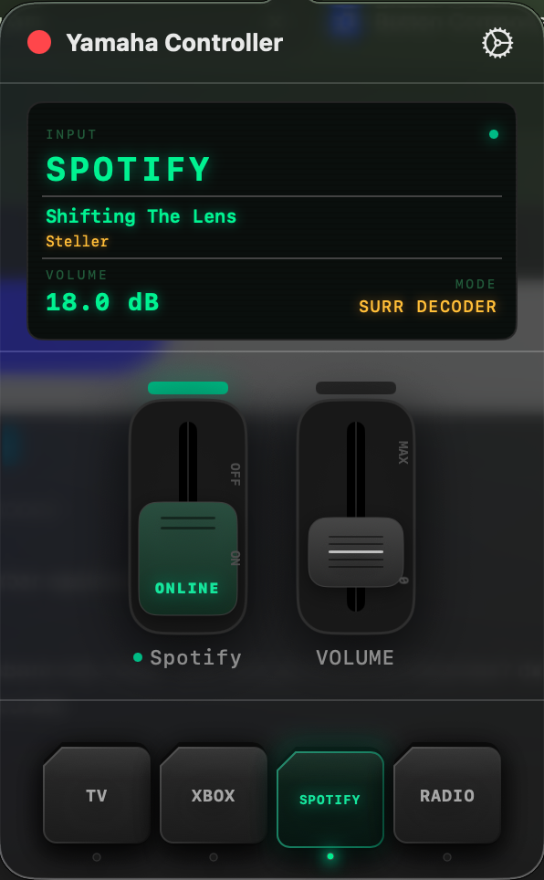

# Yamaha Controller

<p align="center">
  
</p>

A native macOS menu bar application for controlling **Yamaha AV receivers** over your local network — no third-party apps, no subscriptions, no cloud.

<p align="center">
  
</p>

<p align="center">
  
  &nbsp;&nbsp;&nbsp;
  
  &nbsp;&nbsp;&nbsp;
  
</p>

---

## Features

### Receiver Display
A retro LCD-style panel at the top of the popover shows real-time receiver state:
- **Current input source** — large phosphor-green display
- **Volume** — in dB when available, raw value as fallback
- **Sound mode** — DSP/surround program (Straight, Stereo, Surround Decoder, etc.)
- **Now Playing** — for Spotify and Net Radio inputs, shows the current track title and artist/station name, refreshed every 8 seconds
- **Mute indicator** — highlighted in red when active
- **Power dot** — green when on, dim when in standby

### Power Control
An industrial toggle switch controls the receiver power state:
- Drag or tap to toggle between **On** and **Standby**
- Animated handle with ONLINE / STANDBY status text
- Full **power-on sequence**: powers on → sets input → waits → recalls Net Radio preset (configurable delays)

### Volume Control
A mixer-style fader controls the receiver volume:
- **Drag** to set volume
- **Scroll wheel** (mouse or trackpad) to adjust incrementally — works anywhere in the popover while it's open
- Fader position is user-controlled only and does not jump when the receiver reports a different volume after source changes

### Input Source Buttons
Four physical keycap-style buttons for quick source switching. Each button is **fully configurable** in Settings — assign any of the 18 supported YXC input sources to any button independently.

- Active source is highlighted with a green glow and LED indicator
- Button labels update automatically to reflect your configured sources
- State syncs with the receiver — changing source via the remote control is reflected in the UI within 30 seconds

### Morning Alarm
Automatically powers on the receiver at a scheduled time using **launchd**:
- Enable/disable toggle
- Hour and minute picker
- **Day-of-week selector** — toggle individual days (Su Mo Tu We Th Fr Sa); at least one day must remain selected
- **Source selector** — all 18 YXC input sources available
- **Preset picker** (1–5) for Net Radio
- Writes a `launchd` plist to `~/Library/LaunchAgents/` — fires even after Mac sleep/wake
- When all 7 days are selected the plist fires every day; for a subset, separate `StartCalendarInterval` entries are generated per day

### Auto Off
Automatically puts the receiver in standby at a scheduled time:
- Enable/disable toggle
- Hour and minute picker
- **Day-of-week selector** — same per-day granularity as Morning Alarm
- Also managed via `launchd`

### Receiver Discovery
The app automatically finds Yamaha receivers on the local network using Bonjour/mDNS:
- **Discover Receiver** button scans the network and verifies each device via the YXC API
- If one receiver is found, it is selected automatically
- If multiple receivers are found, a list is shown for manual selection
- Discovery times out after 10 seconds with an error message
- Manual IP entry is available as fallback via the **Change** link

Status is refreshed immediately every time the popover is opened — no waiting for the next poll cycle.

### Notifications
The app sends a macOS notification when the receiver is turned on or off automatically by a schedule.

---

## How It Works

The app communicates with the receiver using the **Yamaha Extended Control (YXC) HTTP API** over the local network. All requests are plain HTTP GET calls — no authentication required.

### API Endpoints Used

| Endpoint | Purpose |
|----------|---------|
| `GET /main/getStatus` | Power state, input, volume, mute, sound program |
| `GET /main/setPower?power=on\|standby` | Power on / standby |
| `GET /main/setInput?input={input}` | Switch input source |
| `GET /main/setVolume?volume={n}` | Set volume level |
| `GET /netusb/recallPreset?zone=main&num={n}` | Recall Net Radio preset |
| `GET /netusb/getPlayInfo` | Now playing track / artist / station |

### Polling
- Receiver status is polled every **30 seconds**
- Now Playing info is refreshed every **8 seconds** when input is Spotify or Net Radio
- Optimistic UI updates: input and volume changes are applied immediately in the UI and reverted if the API call fails

### Scheduling (launchd)
The app dynamically writes and manages `.plist` files in `~/Library/LaunchAgents/`:

| Schedule | Plist label |
|----------|-------------|
| Morning Alarm | `com.yamaha-controller.morning` |
| Auto Off | `com.yamaha-controller.poweroff` |

When a schedule is enabled or its settings change, the app removes the old plist, writes a new one, and runs `launchctl bootstrap` to register it. When disabled, it runs `launchctl bootout` and deletes the file.

---

## Technology Stack

| Layer | Technology |
|-------|-----------|
| Language | Swift 5 |
| UI Framework | SwiftUI |
| Networking | URLSession (native, no dependencies) |
| Scheduling | launchd via `launchctl` + shell scripts |
| Persistence | UserDefaults |
| Notifications | UserNotifications framework |
| Build | `swiftc` via custom `scripts/build.sh` |
| Distribution | DMG (ad-hoc signed) |

No external Swift packages. No CocoaPods. No SPM dependencies. Pure Apple frameworks only.

---

## Requirements

- macOS 13.0 (Ventura) or later
- Yamaha receiver with YXC API support on the same local network
- The app is **not sandboxed** — required for writing launchd plist files to `~/Library/LaunchAgents/`

---

## Installation

1. Download `YamahaController-v1.0.0.dmg` from [Releases](../../releases)
2. Open the DMG and drag **Yamaha Controller** to your Applications folder
3. Right-click → **Open** on first launch (app is ad-hoc signed, not notarized)
4. Click the menu bar icon and open **Settings** (gear icon)
5. Click **Discover Receiver** — the app will find your Yamaha automatically
6. If discovery fails, use the **Change** link to enter the IP address manually

---

## Building from Source

```bash
git clone https://github.com/theDanButuc/Yamaha-Controller.git
cd Yamaha-Controller
bash scripts/build.sh
```

Requires Xcode Command Line Tools (`xcode-select --install`). No Xcode.app needed.

The build script compiles all Swift sources with `swiftc`, assembles the `.app` bundle, signs it ad-hoc, and creates a DMG in `dist/`.

---

## Project Structure

```
YamahaController/
├── AppDelegate.swift               # NSStatusItem, NSPopover, menu bar icon
├── YamahaControllerApp.swift       # App entry point (@main)
├── Views/
│   ├── PopoverView.swift           # Root popover layout
│   ├── ReceiverDisplayView.swift   # LCD-style status display
│   ├── ManualControlsView.swift    # Power switch + volume fader
│   ├── VolumeView.swift            # MixerFader component
│   ├── SceneButtonsView.swift      # Input source keycap buttons
│   ├── SettingsView.swift          # IP + source button config + schedules
│   ├── MorningAlarmView.swift      # Morning alarm controls
│   ├── AutoOffView.swift           # Auto off controls
│   └── StatusSectionView.swift     # Status section
├── Models/
│   └── YamahaSettings.swift        # UserDefaults-backed settings
├── Services/
│   ├── YamahaAPIService.swift      # All YXC HTTP calls + polling
│   ├── SchedulerService.swift      # launchd plist management
│   └── DiscoveryService.swift      # Bonjour/mDNS receiver discovery
└── scripts/
    ├── build.sh                    # Compile + bundle + DMG
    └── make_dmg.sh                 # DMG creation helper
```

---

## Settings Persistence

All settings are stored in `UserDefaults`:

| Key | Type | Description |
|-----|------|-------------|
| `yamaha_ip` | String | Receiver IP address |
| `button1_source` … `button4_source` | String | Input source for each scene button |
| `morning_enabled` | Bool | Morning alarm toggle |
| `morning_hour` | Int | Alarm hour (0–23) |
| `morning_minute` | Int | Alarm minute (0–59) |
| `morning_source` | String | Input source for morning alarm |
| `morning_preset` | Int | Net Radio preset (1–5) |
| `morning_weekdays` | [Int] | Selected days (0=Sun … 6=Sat); default all 7 |
| `autooff_enabled` | Bool | Auto off toggle |
| `autooff_hour` | Int | Auto off hour (0–23) |
| `autooff_minute` | Int | Auto off minute (0–59) |
| `autooff_weekdays` | [Int] | Selected days (0=Sun … 6=Sat); default all 7 |

---

## License

MIT License. Feel free to use Yamaha Controller and contribute.
